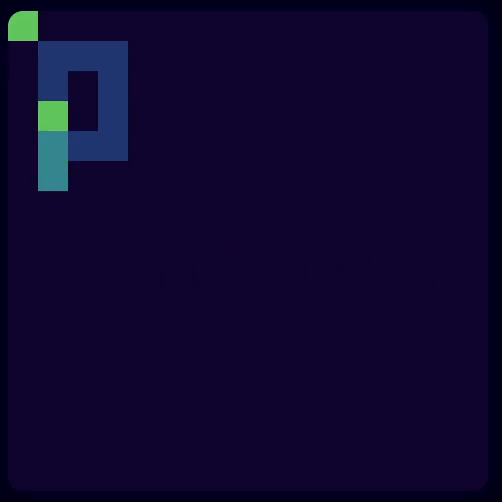

# MagiJS
*Does the technical magic for you.*

## About
**MagiJS** (Make A Game In JavaScript) is a JavaScript framework for making retro-styled web games.
Everything you need is to create a `<script type="module">` tag in your HTML file, write `import "./magi.js";` and start coding,
no creating canvas, no setuping events, only writing code.
The "funny" feature of MAGI is rejection of the standard library and the standart way to write code, with replacing it with it's own.

## Features
- Auto created canvas with a lot of sizing options
- Four four-color palettes to choose from
- Audio: square and noise oscillators
- It's own standart library for a new style of code
- Still in development

## Links
- Snaky example -> [here](examples/snaky.js)
- Small tutorial -> WIP
- API documentation -> WIP
- Suggestions and bugs -> [here]()

***Lunaryss © 2024***
